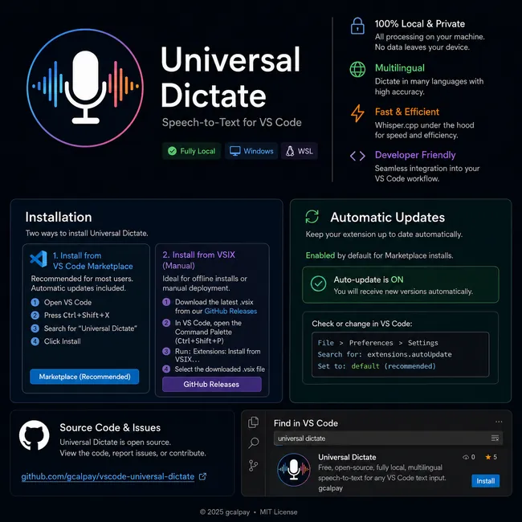

# VS Code Universal Dictate

**Local, offline, multilingual dictation for VS Code on Windows. Supports 99 Whisper languages, Remote - WSL and focused-input dictation into agent/chat extensions such as the OpenAI Codex composer.**

Universal Dictate is an open-source VS Code extension for speech-to-text without API keys or cloud transcription. **Source code, issue tracking and release artifacts are public on [GitHub](https://github.com/gcalpay/vscode-universal-dictate).** It runs the multilingual OpenAI Whisper `base` model locally through `whisper.cpp`, automatically detects the spoken language by default and can be fixed to any of the model's 99 supported languages. Because text is inserted through the focused Windows input control rather than a private extension API, it can also be used with extension-owned agent/chat composers such as OpenAI Codex where normal VS Code text insertion APIs are not available.

> **Version:** 0.1.2 for Windows x64. End-to-end dictation and focused-input insertion have been validated against the OpenAI Codex composer under Remote - WSL on Windows. The extension includes Windows microphone capture, an always-available VS Code status-bar microphone button, a non-activating enhanced recording overlay and local Whisper transcription.



## Installation

### VS Code Marketplace

Public releases are distributed as a Windows x64 VS Code extension. In VS Code, open **Extensions** (`Ctrl+Shift+X`), search for **Universal Dictate** and choose **Install**.

### VSIX

For manual/offline installation, download the latest Windows x64 `.vsix` from [GitHub Releases](https://github.com/gcalpay/vscode-universal-dictate/releases/latest), then install it directly:

```text
Ctrl+Shift+P
Extensions: Install from VSIX...
```

Select the downloaded `universal-dictate-win32-x64.vsix` file and reload VS Code if prompted. Marketplace installation is recommended for normal users because VS Code handles extension updates automatically. VS Code disables auto-update by default for extensions installed manually from a VSIX.

Do not install a separate copy inside WSL. Universal Dictate declares `extensionKind: ["ui"]` so it runs in the local Windows extension host while a workspace may remain connected through Remote - WSL.

On first dictation, Universal Dictate downloads the multilingual Whisper `base` model (about 148 MB), verifies its SHA-256 checksum and stores it in VS Code's local extension storage. After that, normal dictation can run offline.

For lower post-recording latency, Universal Dictate starts a local `whisper-server` worker when recording begins and keeps the model loaded for later dictations. Model initialization therefore overlaps with the time you are speaking instead of starting only after you press Insert or stop recording. The worker listens only on `127.0.0.1` behind a randomized per-session request path. If it cannot start or exits unexpectedly, Universal Dictate automatically falls back to the one-shot `whisper-cli` path. The current Windows build remains CPU-only.

## Product goals

- Local speech-to-text with no API key or cloud transcription.
- Multilingual dictation with automatic language detection and explicit selection from 99 Whisper languages.
- Windows 10/11 as the supported desktop platform.
- Works from a Windows VS Code client while the workspace is connected through Remote - WSL.
- Inserts dictated text into the text control that had focus, including extension-owned agent/chat composers such as OpenAI Codex where practical.
- Never submits dictated text automatically.
- Terminal dictation disabled by default.
- No Python, Conda, FFmpeg or WSL-side runtime dependency for end users.
- Live microphone visualization with Insert and Discard controls that do not activate another window or steal the target caret.
- Reuse a persistent local Whisper worker after first use to avoid reloading the model for every utterance.

## Current controls

Universal Dictate activates after VS Code starts and shows an always-visible **$(mic) Dictate** action and a settings gear in the right-side status-bar utility group. Click **Dictate** to start recording, or use the keyboard shortcut:

```text
Status bar: $(mic) Dictate   Start recording
Ctrl+Alt+D                   Start recording
Ctrl+Alt+D                   Stop, transcribe locally and insert
Esc                          Cancel the current recording
```

The default **Enhanced overlay** is a native Windows, non-activating recording panel with a sensitive signed PCM signal display. The visualization keeps a bounded downsampled history of the captured microphone waveform, uses a monochrome technical-green signal style and keeps previously captured samples visually stable as they move through the history.

```text
Insert    stop, transcribe and insert
Discard   cancel and discard
```

The overlay uses Win32 `WS_EX_NOACTIVATE` behavior so clicking **Insert** or **Discard** does not intentionally move keyboard focus away from the VS Code editor/composer where the transcript will be inserted. Its monitor placement follows the active VS Code monitor and supports multi-monitor virtual-screen coordinates, including monitors positioned at negative coordinates.

The settings gear provides the current audio-visualization choices:

- **Enhanced overlay** — default; native PCM waveform overlay plus static recording feedback in the status bar.
- **Both** — Enhanced overlay plus the animated status-bar signal history.
- **Status bar only** — animated status-bar signal without the native overlay.
- **Off** — no waveform visualization; static recording feedback remains available.

Visualization changes apply from the next dictation session. The legacy large overlay is no longer selectable; existing persisted legacy `overlay` settings are treated as Enhanced overlay for compatibility.

## Languages

The default is **Auto-detect**. The bundled multilingual Whisper `base` model supports the original **99 Whisper languages**. Recognition quality varies by language and audio conditions.

Language selection is available from the settings gear or from the Command Palette:

```text
Universal Dictate: Select Language
```

You can leave language detection automatic or force any one of the 99 supported languages.

The extension uses the Windows default microphone, records 16 kHz mono PCM16 WAV through miniaudio and transcribes it locally with a bundled, pinned `whisper.cpp` runtime.

## Recognition stack and attribution

Universal Dictate does not implement the speech-recognition neural network itself.

- **OpenAI Whisper** provides the original Whisper model architecture and model weights. OpenAI releases both the Whisper code and model weights under the MIT License.
- **whisper.cpp** is the independent C/C++ implementation used to run Whisper locally in Universal Dictate. It is maintained by the ggml project and is MIT licensed.
- Universal Dictate uses a converted `ggml-base.bin` representation of OpenAI's multilingual Whisper `base` model for local inference.

The relevant upstream license notices are retained in `third_party/`.

## Implementation

- TypeScript: VS Code integration, commands, state, UI, language selection, visualization selection, model management and transcription orchestration.
- C++20: Universal Dictate's native Windows microphone process, non-activating recording overlay and focused-input paste helper.
- miniaudio: permissively licensed microphone/audio backend.
- OpenAI Whisper: MIT-licensed speech-recognition model and weights.
- whisper.cpp: MIT-licensed local Whisper inference runtime, using its local HTTP server to keep the model warm between dictations and its CLI as a fallback.
- OpenWhispr: MIT-licensed historical source lineage for the Windows focused-input paste helper. The current helper has been substantially rewritten in C++20 and reduced to Universal Dictate's Ctrl+V-only use case; the upstream MIT notice is retained.

The recorder, overlay and VS Code integration are maintained as Universal Dictate code. Provenance for the focused-input paste helper is documented explicitly in [`THIRD_PARTY_NOTICES.md`](THIRD_PARTY_NOTICES.md) and [`docs/DEPENDENCIES.md`](docs/DEPENDENCIES.md).

## Privacy

Normal dictation is local. Microphone audio is written to a temporary local WAV file, sent only to the bundled `whisper.cpp` worker over the local loopback interface, transcribed locally and deleted after transcription. Audio and transcripts are not sent to a remote transcription service.

The only network operation required for normal setup is the initial Whisper model download.

## Support

Use GitHub Issues for bugs, compatibility problems and feature requests. See [`SUPPORT.md`](SUPPORT.md) for the diagnostic information that is useful in a report.

## Third-party components

Universal Dictate itself is MIT licensed and uses permissively licensed infrastructure and source lineage:

- OpenAI Whisper: speech-recognition model and model weights (MIT)
- whisper.cpp: local Whisper inference runtime (MIT)
- miniaudio: Windows microphone capture (MIT-0/public-domain dual license)
- OpenWhispr: historical source lineage for the Win32 focused-input paste helper (MIT)

See [`docs/DEPENDENCIES.md`](docs/DEPENDENCIES.md), [`THIRD_PARTY_NOTICES.md`](THIRD_PARTY_NOTICES.md) and `third_party/` for pinned versions, provenance and license notices.

## License

Universal Dictate is MIT licensed. See [LICENSE](LICENSE).
