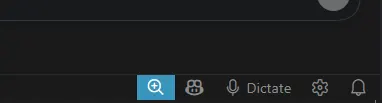
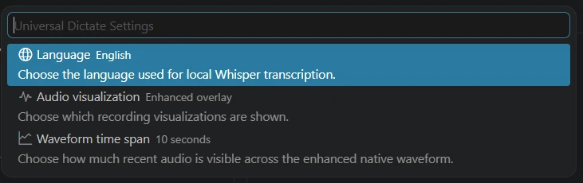

# VS Code Universal Dictate

**Local, offline dictation for VS Code on Windows. Dictate into editors and agent/chat prompts such as Codex, then review the transcript before sending. 99 Whisper languages. Remote-WSL.**

**Open source · MIT · [GitHub](https://github.com/gcalpay/vscode-universal-dictate)**






Universal Dictate transcribes locally with the multilingual Whisper `base` model through `whisper.cpp`, including automatic punctuation, and inserts the transcript where the text cursor is currently active. It works in VS Code editors and agent/chat prompts and can also paste into text fields in other Windows applications while Universal Dictate is running. **It never submits or sends dictated text automatically.**

## Installation

### VS Code Marketplace

In VS Code, open **Extensions** (`Ctrl+Shift+X`), search for **Universal Dictate** and choose **Install**.

### VSIX

For manual/offline installation, download the latest Windows x64 `.vsix` from [GitHub Releases](https://github.com/gcalpay/vscode-universal-dictate/releases/latest), then install it directly:

```text
Ctrl+Shift+P
Extensions: Install from VSIX...
```

Do not install a separate copy inside WSL. Universal Dictate declares `extensionKind: ["ui"]` so it runs in the local Windows extension host while a workspace may remain connected through Remote - WSL.

On first dictation, Universal Dictate downloads the multilingual Whisper `base` model (about 148 MB), verifies its SHA-256 checksum and stores it in VS Code's local extension storage. After that, normal dictation can run offline.

For lower post-recording latency, Universal Dictate starts a local `whisper-server` worker when recording begins and keeps the model loaded for later dictations. Model initialization overlaps with the time you are speaking. The worker listens only on `127.0.0.1` behind a randomized per-session request path. If it cannot start or exits unexpectedly, Universal Dictate automatically falls back to the one-shot `whisper-cli` path. The current Windows build remains CPU-only.

## Current controls

Universal Dictate shows an always-visible **Dictate** action and settings gear in VS Code's right-side status-bar utility group.

```text
Status bar: Dictate             Start recording
Ctrl+Alt+D                      Start recording
Ctrl+Alt+D                      Stop, transcribe locally and insert
Esc                             Cancel the current recording
Insert                          Stop, transcribe and insert
Discard                         Cancel and discard
```

The default **Enhanced overlay** is a native Windows, non-activating recording panel with a sensitive signed PCM signal display. Captured waveform samples stay visually stable as they move through the bounded history.

The audio-visualization choices are:

- **Enhanced overlay** — default; native PCM waveform overlay plus static recording feedback in the status bar.
- **Both** — Enhanced overlay plus the animated status-bar signal history.
- **Status bar only** — animated status-bar signal without the native overlay.
- **Off** — no waveform visualization; static recording feedback remains available.

The Enhanced waveform time span is configurable, so you can choose how much recent audio is visible across the waveform. This only changes the visualization and does **not** limit dictation length.

Visualization and waveform time-span changes apply from the next dictation session. Existing persisted legacy `overlay` settings are treated as Enhanced overlay for compatibility.

## Languages

The default is **Auto-detect**. The bundled multilingual Whisper `base` model supports the original **99 Whisper languages**. Recognition quality varies by language and audio conditions.

Language selection is available from the settings gear or from the Command Palette:

```text
Universal Dictate: Select Language
```

The extension uses the Windows default microphone, records 16 kHz mono PCM16 WAV through miniaudio and transcribes it locally with a bundled, pinned `whisper.cpp` runtime.

## Privacy

Normal dictation is local. Microphone audio is written to a temporary local WAV file, sent only to the bundled `whisper.cpp` worker over the local loopback interface, transcribed locally and deleted after transcription. Audio and transcripts are not sent to a remote transcription service.

The only network operation required for normal setup is the initial Whisper model download.

## Implementation and attribution

- TypeScript: VS Code integration, commands, state, settings, model management and transcription orchestration.
- C++20: native Windows microphone process, non-activating recording overlay and focused-input paste helper.
- OpenAI Whisper: MIT-licensed speech-recognition model and model weights.
- whisper.cpp: MIT-licensed local Whisper inference runtime.
- miniaudio: permissively licensed microphone/audio backend.
- OpenWhispr: MIT-licensed historical source lineage for the focused-input Windows paste helper; the current helper has been substantially rewritten and reduced to Universal Dictate's focused-paste use case.

See [`docs/DEPENDENCIES.md`](docs/DEPENDENCIES.md), [`THIRD_PARTY_NOTICES.md`](THIRD_PARTY_NOTICES.md) and `third_party/` for pinned versions, provenance and license notices.

## Support

Use [GitHub Issues](https://github.com/gcalpay/vscode-universal-dictate/issues) for bugs, compatibility problems and feature requests. See [`SUPPORT.md`](SUPPORT.md) for useful diagnostic information.

## License

Universal Dictate is MIT licensed. See [LICENSE](LICENSE).
