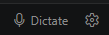
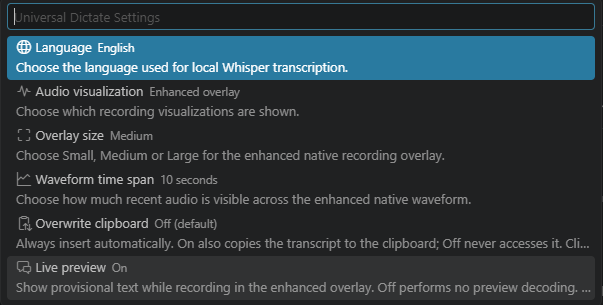
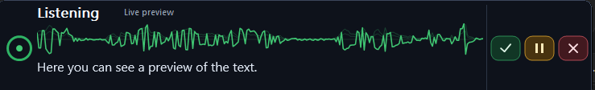
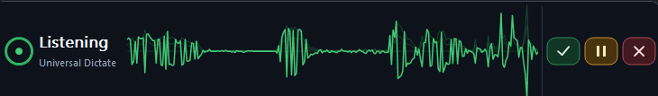

# VS Code Universal Dictate

**Local, offline dictation for VS Code on Windows, including Remote - WSL. Dictate into editors and agent/chat prompts such as Codex, then review the transcript before sending. 99 Whisper languages.**

**Open source · MIT · [GitHub](https://github.com/gcalpay/vscode-universal-dictate)**

*Example settings with Live preview enabled; the defaults are listed below.*

Universal Dictate transcribes locally with the multilingual Whisper `base` model through `whisper.cpp`, including automatic punctuation, and sends the completed transcript as Unicode text to the input that owns keyboard focus at insertion time. It works in VS Code editors and agent/chat prompts and can also insert into compatible text fields in other Windows applications while Universal Dictate is running. **It never submits or sends dictated text automatically.**

Available from the [VS Code Marketplace](https://marketplace.visualstudio.com/items?itemName=gcalpay.vscode-universal-dictate).

## Settings

Open the settings gear next to **Dictate**, or find **Universal Dictate** in VS Code Settings.

| Setting | What it does | Default |
| --- | --- | --- |
| **Language** | Choose the language you intend to speak, or Auto-detect. All 99 Whisper languages are available. | **English** |
| **Audio visualization** | Choose Enhanced overlay, Both (overlay and status-bar waveform), Status bar only, or Off. | **Enhanced overlay** |
| **Overlay size** | Choose Small, Medium or Large. | **Medium** |
| **Waveform time span** | Show the latest 1, 3, 5, 10 or 20 seconds in the overlay waveform. This does not limit recording length. | **1 second** |
| **Overwrite clipboard** | Also copy the final transcript to the clipboard, replacing its previous contents. Automatic insertion still uses direct text input. | **Off** |
| **Live preview** | Show provisional text while speaking. Requires Enhanced overlay or Both. | **Off** |

Change settings before starting a recording. Changes made during a recording apply to the next one. Saved choices take precedence over the defaults.

### Live preview

When enabled, the overlay shows recent provisional words, which may be revised as recognition continues. It is not a complete transcript history. After Stop, Universal Dictate transcribes the **complete recording** and inserts the final transcript once.

Preview and final transcription both run locally. Preview adds processing work and some delay, particularly with Auto-detect. Turning it Off removes the extra preview processing; Status bar only and Off visualization do not run invisible previews.

## Controls

| Control | Action |
| --- | --- |
| Status bar: **Dictate** | Start recording |
| Status bar: **Stop** | Stop, transcribe locally and insert |
| **Ctrl+Alt+D** | Start or stop dictation |
| **Esc** | Cancel the current recording |
| Overlay: **Insert** | Stop, transcribe and insert |
| Overlay: **Discard** | Cancel and discard |

The recording overlay does not take keyboard focus when clicked. Review the inserted text before sending it.

## Languages

English is selected by default. Choose another language or **Auto-detect** from the settings gear or **Universal Dictate: Select Language** in the Command Palette (`Ctrl+Shift+P`). Recognition quality varies by language and audio conditions.

**Note:** Select the language you intend to speak, or use Auto-detect. If you select a different language from the one being spoken, Whisper can translate the speech into the selected language. This translation is performed entirely offline by the local multilingual Whisper model; no audio or text is sent to an online translation service.

## Clipboard and transcript recovery

Automatic insertion does not require the clipboard. With **Overwrite clipboard Off**, automatic dictation leaves the clipboard untouched. With it **On**, the exact final transcript is also copied before insertion, replacing the previous clipboard contents. There is no later restoration, and a subsequent copy from another application takes precedence.

Use **Universal Dictate: Copy Last Transcript** from the Command Palette to copy the latest successful final transcript again. This explicit command replaces the clipboard regardless of the automatic setting. The retained transcript stays in this window's extension memory only; it is lost when the extension reloads or VS Code restarts.

With no usable focused input, insertion may do nothing. The clipboard option provides a manual-paste backup. Provisional preview text is never inserted or copied. Direct insertion converts line breaks and tabs to spaces to avoid triggering input commands; an explicit or enabled clipboard copy retains the original final text.

## Local processing and privacy

Universal Dictate uses the Windows default microphone. On first use, it downloads the multilingual Whisper `base` model (about 148 MB), verifies the download's SHA-256 checksum and stores it locally. **After model setup, normal dictation and live preview can run offline.** No API key or cloud account is required.

Speech recognition runs on the CPU through the bundled `whisper.cpp` runtime. Its worker communicates over the computer's local loopback interface, not a remote transcription service. Audio and transcripts are not uploaded for transcription or translation. The complete recording is a temporary local WAV file that is cleaned up after processing; preview uses a bounded in-memory audio buffer.

For **Remote - WSL**, the extension runs in the local Windows VS Code host while your workspace stays in WSL. It is not a native Linux extension and does not need a separate WSL-side microphone setup.

## Known insertion-target limitation

Clicking VS Code's status-bar Dictate or Stop control can move focus away from inputs such as the Codex composer, so insertion may miss the intended caret. Use the keyboard shortcut or overlay controls where appropriate, or enable **Overwrite clipboard** to retain a manual-paste backup. [Issue #38](https://github.com/gcalpay/vscode-universal-dictate/issues/38) tracks this limitation; clipboard recovery does not fix focus preservation.

## Attribution

Universal Dictate uses OpenAI Whisper, whisper.cpp and miniaudio, and retains attribution for the historical OpenWhispr input-helper lineage. See [third-party notices](THIRD_PARTY_NOTICES.md) and [dependency details](docs/DEPENDENCIES.md) for licenses and provenance.

## Support and release notes

Report problems or request features through [GitHub Issues](https://github.com/gcalpay/vscode-universal-dictate/issues). See [support information](SUPPORT.md) for useful diagnostic details and the [Changelog](CHANGELOG.md) for version history.

## License

MIT licensed. See [LICENSE](LICENSE).
