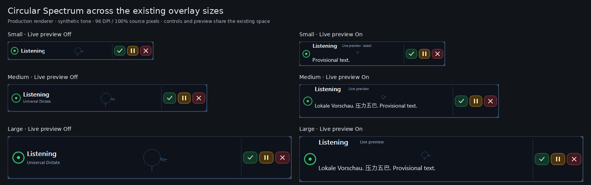

# VS Code Universal Dictate

**Local, offline dictation for VS Code on Windows, including Remote - WSL. Dictate into editors and agent/chat prompts such as Codex, then review the transcript before sending. 99 Whisper languages.**

**Open source · MIT · [GitHub](https://github.com/gcalpay/vscode-universal-dictate)**

*Blue is the new default; the waveform illustrations show the optional Green palette. This branch describes the unpublished 1.2.0 integrated review candidate. The settings table below includes all eight current controls.*

Universal Dictate transcribes locally with the multilingual Whisper `base` model through `whisper.cpp`, including automatic punctuation, and sends the completed transcript as Unicode text to the input that owns keyboard focus at insertion time. It works in VS Code editors and agent/chat prompts and can also insert into compatible text fields in other Windows applications while Universal Dictate is running. **It never submits or sends dictated text automatically.**

**Other Windows applications:** Start dictation from Universal Dictate, then focus a compatible text field in another app. The final text is inserted there while VS Code remains running. The overlay controls work there too; keyboard shortcuts are local to VS Code, not system-wide.

Available from the [VS Code Marketplace](https://marketplace.visualstudio.com/items?itemName=gcalpay.vscode-universal-dictate).

## Settings

Open the settings gear next to **Dictate**, or find **Universal Dictate** in VS Code Settings.

| Setting | What it does | Default |
| --- | --- | --- |
| **Language** | Choose the language you intend to speak, or Auto-detect. All 99 Whisper languages are available. | **English** |
| **Audio visualization** | Choose Enhanced overlay, Both (overlay and status-bar waveform), Status bar only, or Off. | **Enhanced overlay** |
| **Enhanced Overlay Visualization** | Choose Waveform / Oscillogram, Log-Frequency Power Spectrogram or Circular Spectrum. Affects the enhanced overlay only. | **Waveform / Oscillogram** |
| **Colors** | Choose Blue, Green, Amber or Violet for any native visualization; control and status-bar colors stay unchanged. | **Blue** |
| **Overlay size** | Choose Small, Medium or Large. | **Medium** |
| **Overlay history** | Show the latest 1, 3, 5, 10 or 20 seconds of accepted audio in Waveform or a scrolling spectrogram. Circular Spectrum shows the latest frame instead. This does not limit recording length. | **10 seconds** |
| **Overwrite clipboard** | Also copy the final transcript to the clipboard, replacing its previous contents. Automatic insertion still uses direct text input. | **Off** |
| **Live preview** | Show provisional text while speaking. Requires Enhanced overlay or Both. | **Off** |

Change settings before starting a recording. Changes made during a recording apply to the next one. Saved choices take precedence over the defaults. Medium is the default overlay size. With Live preview Off, the rectangular overlay is shorter; enabling preview reserves room for readable text without narrowing the waveform. Circular Spectrum uses a larger square when preview is enabled.

### Enhanced overlay visualizations (unreleased)

**Audio visualization** controls *where* feedback appears. **Enhanced Overlay Visualization** controls *what the native overlay draws*. The status-bar waveform is independent. Selecting a renderer neither enables a disabled overlay nor changes the current recording; the preference is retained for the next session using Enhanced overlay or Both.

**Waveform / Oscillogram** retains the original 1.1.2 amplitude, history and line geometry. Its default color is now **Blue**; **Green** retains the earlier green trace. **Log-Frequency Power Spectrogram** retains the original blue/teal power palette by default. **Circular Spectrum** shows the latest FFT frame in a dedicated **rounded-square card**, with a header, large central spectrum and a separate row of Insert / Pause / Discard controls. Live preview gets its own complete text lines above the buttons; the card remains square.

All four palettes contain dark-to-light shades. Color selection changes only appearance, not microphone gain or signal scaling. Blue, Green, Amber and Violet apply independently of style, size, language, clipboard and live-preview preferences, from the next recording. Button action colors and the status bar remain unchanged.

The log spectrogram scrolls right to left with low frequencies at the bottom. Its fixed digital power scale is not acoustic loudness or automatic gain. Circular Spectrum is not a scrolling spectrogram; Overlay history does not apply to it. Both spectral modes use the unchanged 16 kHz speech audio.

Linear and Constant-Q were retired from the review candidates because they duplicated the intended choices for this dictation app. Existing saved values resolve to Log-Frequency Power Spectrogram without rewriting preferences or enabling a disabled overlay. Waveform remains the default for missing or invalid values.

All modes preserve Pause/Resume, original accepted WAV samples, local transcription, clipboard policy and one final insertion. No new runtime dependencies or model downloads are required. Earlier green waveform illustrations below show the retained **Green** palette; Circular Spectrum uses its own square size presets.

*These earlier production-renderer illustrations show the unchanged rectangular Waveform layout in Green. Circular Spectrum now uses the dedicated rounded-square layout described above.*

### Live preview

When enabled, the overlay shows recent provisional words, which may be revised as recognition continues. It is not a complete transcript history. After Stop, Universal Dictate transcribes the **complete recording** and inserts the final transcript once.

Preview and final transcription both run locally. In this review candidate, preview uses a separate on-demand worker (up to two threads) so final transcription does not share its inference queue. Stop or Discard retires the preview worker; the final worker stays warm. The extra model instance uses additional memory while preview is active: a controlled Windows benchmark observed about 256 MiB of preview-process working set, which is not a measurement of additional unique physical RAM. Worker startup and the thread cap can delay the first preview. Turning preview Off avoids the second worker; Status bar only and Off visualization do not run invisible previews. See [M1 implementation and measurement limits](docs/M1_FINAL_INFERENCE_PRIORITY.md).

## Controls

| Control | Action |
| --- | --- |
| Status bar: **Dictate** | Start recording |
| Status bar: **Stop** | Stop, transcribe locally and insert |
| **Ctrl+Alt+D** | Start or stop dictation |
| **Ctrl+Alt+P** | Pause or resume recording within VS Code |
| **Esc** | Cancel the current recording, including while paused |
| Overlay: **Insert** | Stop, transcribe and insert |
| Overlay: **Pause / Resume** | Pause or continue the same recording |
| Overlay: **Discard** | Cancel and discard |

The compact overlay buttons are **✓ Insert / Ⅱ Pause (or ▶ Resume) / ✕ Discard**, colored green, amber and red, with descriptive hover labels. The recording overlay does not take keyboard focus when clicked. Review the inserted text before sending it.

### Pause and resume

Pause to think, then Resume to continue the same recording. Audio received while paused is ignored: it is not saved in the WAV, added to any audio visualization or sent to preview recognition. The selected visualization and provisional text freeze; Stop/Insert still transcribes the accepted speech once, and Discard still cancels. There is no silence gap added for the paused time.

The microphone device stays open while paused, so Windows may continue to show its microphone-use indicator. Pause is not a hardware mute. Use Discard to end the session.

## Languages

English is selected by default. Choose another language or **Auto-detect** from the settings gear or **Universal Dictate: Select Language** in the Command Palette (`Ctrl+Shift+P`). Recognition quality varies by language and audio conditions.

Select the language you intend to speak, or use Auto-detect. The language setting controls recognition; Universal Dictate does not provide a supported translation mode. Selecting a language different from the spoken language can produce unreliable output.

## Clipboard and transcript recovery

Automatic insertion does not require the clipboard. With **Overwrite clipboard Off**, automatic dictation leaves the clipboard untouched. With it **On**, the exact final transcript is also copied before insertion, replacing the previous clipboard contents. There is no later restoration, and a subsequent copy from another application takes precedence.

Use **Universal Dictate: Copy Last Transcript** from the Command Palette to copy the latest successful final transcript again. This explicit command replaces the clipboard regardless of the automatic setting. The retained transcript stays in this window's extension memory only; it is lost when the extension reloads or VS Code restarts.

With no usable focused input, insertion may do nothing. The clipboard option provides a manual-paste backup. Provisional preview text is never inserted or copied. Direct insertion converts line breaks and tabs to spaces to avoid triggering input commands; an explicit or enabled clipboard copy retains the original final text.

## Local processing and privacy

Universal Dictate uses the Windows default microphone. On first use, it downloads the multilingual Whisper `base` model (about 148 MB), verifies the download's SHA-256 checksum and stores it locally. **After model setup, normal dictation and live preview can run offline.** No API key or cloud account is required.

Speech recognition runs on the CPU through the bundled `whisper.cpp` runtime. Its workers communicate over the computer's local loopback interface, not a remote transcription service. Audio and transcripts are not uploaded for recognition. The complete recording is a temporary local WAV file that is cleaned up after processing; preview uses a bounded in-memory audio buffer. Timing diagnostics contain neither audio nor transcript text.

For **Remote - WSL**, the extension runs in the local Windows VS Code host while your workspace stays in WSL. It is not a native Linux extension and does not need a separate WSL-side microphone setup.

## Known insertion-target limitation

Clicking VS Code's status-bar Dictate or Stop control can move focus away from inputs such as the Codex composer, so insertion may miss the intended caret. Use the keyboard shortcut or overlay controls where appropriate, or enable **Overwrite clipboard** to retain a manual-paste backup. [Issue 38](https://github.com/gcalpay/vscode-universal-dictate/issues/38) tracks this limitation; clipboard recovery does not fix focus preservation.

## Attribution

Universal Dictate uses OpenAI Whisper, whisper.cpp and miniaudio, and retains attribution for the historical OpenWhispr input-helper lineage. See [third-party notices](THIRD_PARTY_NOTICES.md) and [dependency details](docs/DEPENDENCIES.md) for licenses and provenance.

## Support and release notes

Report problems or request features through [GitHub Issues](https://github.com/gcalpay/vscode-universal-dictate/issues). See [support information](SUPPORT.md) for useful diagnostic details and the [Changelog](CHANGELOG.md) for version history.

If timing evidence is needed, **Universal Dictate: Show Latency Report** opens the latest 100 completed measurements in one document. Records stay in the current extension-host session and are lost on reload unless that document is saved. Normal use of one integrated candidate is the acceptance workflow; no prescribed sentence, repetition count or per-recording screenshot is required. The [M5 review record](docs/M5_REVIEW_CLOSEOUT.md) separates the completed automated comparisons from analyzer review and user acceptance.

## License

MIT licensed. See [LICENSE](LICENSE).
