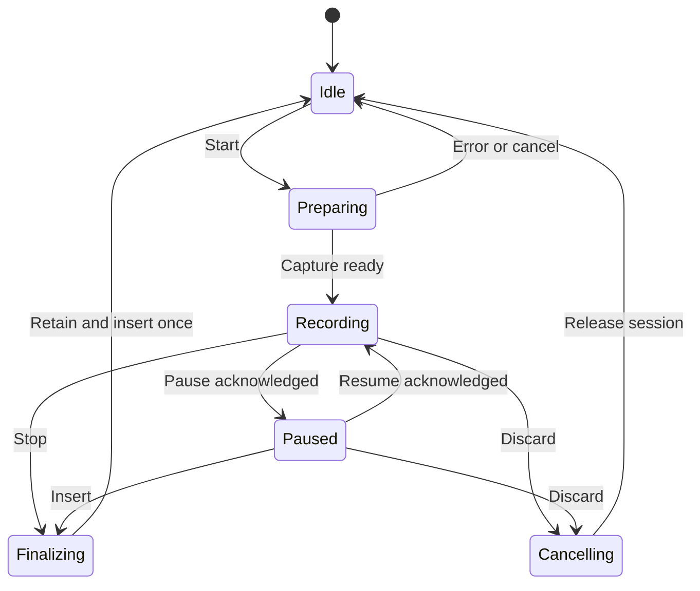

# Architecture

## Scope and current state

Universal Dictate 1.2.0 is an unpublished integrated review candidate for local
speech-to-text on Windows. It runs in the local Windows **UI extension host**,
including with a Remote - WSL workspace. It does not depend on Codex/Copilot
private UI or require a WSL-side microphone, inference runtime or Python install.

M1 final-inference isolation and all five overlay styles are implemented. M5
confirmation passed; analyzer/cache review and normal-use integrated acceptance
have separate records in [M5_REVIEW_CLOSEOUT.md](M5_REVIEW_CLOSEOUT.md) and
[M6_INTEGRATED_CANDIDATE.md](M6_INTEGRATED_CANDIDATE.md). Historical M1–M7 document
numbers describe earlier work and do not define the current release status.

## Runtime components

| Component | Responsibility and boundary |
| --- | --- |
| TypeScript UI extension | Commands, seven settings, session ownership, model setup, preview scheduling, final transcript retention, optional clipboard copy and direct-input orchestration |
| Native C++20 recorder | miniaudio/WASAPI capture, original 16 kHz mono PCM16 WAV, bounded preview snapshots, accepted waveform and optional visual-only spectral queue |
| Native overlay | Non-activating Insert/Pause/Discard controls; selected renderer and preview text within existing size/DPI geometry |
| Final Whisper worker | Dedicated warm loopback server for complete accepted WAV; original final parameters and final-only CLI fallback |
| Preview Whisper worker | Distinct lazy loopback server, at most two inference threads, best-effort below-normal priority and explicitly owned retirement |
| Windows input helper | `windows-text-input.exe`: focused Unicode `SendInput`, bounded batches, cancellation and focus/modifier checks |
| Remote - WSL | Workspace only; microphone, model storage, inference and helpers stay on Windows |

Whisper servers bind to loopback with randomized request paths. The multilingual
`base` model is downloaded on first use, SHA-256 verified and reused locally.
The final worker starts warming during recording and survives completed sessions.
The model/runtime and final inference settings are unchanged by the visualizers.

## Final and preview ownership

Preview is opt-in, **Off by default**, and effective only with Enhanced overlay or
Both. The coordinator bounds/coalesces work and rejects stale session results.
Provisional text is neither inserted nor copied. Stop still transcribes the full
accepted WAV once; preview does not replace authoritative final recognition.

M1 separates preview from the warm final worker. Stop/Cancel/disposal aborts
preview transport and retires only the owned preview process, including startup
and idle cases. Retirement waits for actual child exit: cancelling an HTTP client
request is not evidence that native computation stopped. Graceful shutdown has a
150 ms escalation and 1 s confirmation deadline. If exit is unconfirmed, further
preview workers are disabled for that runtime to avoid accumulating orphans while
final dictation remains available. Do not describe that timeout as confirmed exit.
Only final transcription can use the existing CLI fallback.

The separate preview model increases resource use. Historical M1 evidence measured
about 255.6 MiB of preview-process working set; summed working sets do not measure
additional unique physical RAM. Preview startup and the two-thread cap can delay
the first hypothesis. Preview Off creates no second worker. The benchmark observed
both workers below-normal, so it does not establish a relative-priority advantage.
See [M1_FINAL_INFERENCE_PRIORITY.md](M1_FINAL_INFERENCE_PRIORITY.md).

## Recording and pause lifecycle

`recording-pause.h` gates capture admission without blocking the callback or
reopening the microphone. PAUSED is acknowledged after admitted callbacks drain.
Paused PCM enters neither WAV, preview, waveform nor spectral analysis. Resume
continues the accepted-audio timeline without adding a silence gap. The displayed
frame and provisional text freeze while paused; partial transform state is retained.

The engine keeps one operation owner while recording/paused. Stop, Cancel and
disposal can win during a pending transition; unconfirmed Pause/Resume cancels with
an error. Pause invalidates active preview and suspends scheduling; Resume restarts
lazily on the existing schedule. An idle preview worker may remain until session
retirement. The microphone stays open: Pause is not a hardware mute.

## Seven independent settings

All settings are snapshotted before asynchronous preparation and apply to the next
recording. Explicit preferences and effective workspace overrides are preserved.
Prefix these keys with `universalDictate.`:

| Key | Default | Responsibility |
| --- | --- | --- |
| `language` | `en` | Recognition language or Auto |
| `visualization` | `enhancedOverlay` | Location: overlay, both, status bar or off |
| `enhancedOverlayVisualization` | `waveform` | Enhanced-overlay style only |
| `overlaySize` | `medium` | Small/Medium/Large layout |
| `waveformTimeSpanSeconds` | `10` | Existing stored key; Overlay history 1/3/5/10/20 seconds |
| `overwriteClipboard` | `false` | Optional automatic final-transcript copy |
| `livePreview` | `false` | Optional provisional recognition with a visible overlay |

The five styles are Waveform / Oscillogram, Log-Frequency Power Spectrogram,
Linear-Frequency Power Spectrogram, Constant-Q Power Spectrogram and Circular
Spectrum. Missing/invalid style values fall back to Waveform. A style change does
not enable a disabled overlay, change the status-bar mode or mutate another setting.
Status bar only / Off creates no native overlay or spectral analyzer. Waveform
itself runs no spectral analysis. Circular Spectrum is latest-frame only; history
controls the waveform and scrolling spectrograms.

## Capture, visual analysis and painting

Original admitted PCM still goes to WAV, preview, waveform history and the raw peak
meter. The optional analyzer receives an additional bounded copy. No FFT/CQT,
allocation, blocking wait or new disk I/O is added to the capture callback. The
existing WAV writer remains part of that callback's accepted recording path.

The SPSC visual queue holds 32,768 frames (2.048 s at 16 kHz). One overlay update
processes at most 8192 samples at the existing 50 ms cadence. Stop does not drain
visual analysis. Overflow drops an entire visual-only chunk; sequence gaps reset
transform context and blank missing history. WAV/preview samples remain independent.
Allocation/overlay failure disables unnecessary analysis and falls back safely;
analyzer lifetime extends through capture-device shutdown.

FFT modes use a 1024-sample periodic Hann window and 256-sample hop. Constant-Q
uses an actual variable-length complex filter bank. Completed spectral columns have
fixed digital power colors, with no AGC or recoloring. Rendering max-pools reduced
cells so narrow signals are not skipped. Detailed numerical definitions and limits
are in [OVERLAY_VISUALIZATIONS.md](OVERLAY_VISUALIZATIONS.md). Accepted waveform
buckets, paint function and level mapping remain unchanged.

Small/Medium/Large share DPI-aware geometry, with Medium the default. Preview Off
uses a shorter window; Preview On reserves one complete line in Small and up to two
in Medium/Large. Controls retain aligned hit areas and non-activating hover labels.
The current circular renderer stays inside that viewport even when compact preview
leaves little height. Text changes and Pause/Resume do not resize the window.

Preview text uses a raster cache keyed by text, viewport dimensions, font height
and line limit. Unchanged text is copied with BitBlt; text/size/font changes rebuild
the raster with the existing shaping/clipping/color-font/antialiasing operations.
Reset releases resources in order. The earlier exact-RGB oracle failure and its
review are recorded separately; later green tests are not a root-cause explanation.

## Insertion, clipboard and recovery

`windows-text-input.exe` sends the completed transcript as Unicode events to the
input owning focus at insertion time. It does not inspect an opaque composer's DOM
or synthesize Ctrl+V. It waits for physical shortcut modifiers rather than restoring
potentially stale modifier state, and checks focus/modifiers between bounded batches.
Line breaks and tabs are converted to spaces for direct input, preventing Enter/Tab
or automatic submission. Cancellation cannot retract input already accepted by
Windows. Helper completion is not acknowledgement that the target painted the text.

With **Overwrite clipboard Off**, automatic dictation does not read or write the
clipboard. With it **On**, the exact final text is copied before the same input
attempt, with no later restoration; subsequent user/application copies win.
**Copy Last Transcript** explicitly copies the latest successful nonempty final
transcript irrespective of that automatic setting. The retained transcript is only
in this window's extension memory and disappears on reload/restart.

VS Code owns the genuine status-bar DOM item. A primary mouse click can move focus
before the extension command runs and lose the caret in opaque composers. Issue
#38 remains unresolved. Native overlay controls and keyboard/recovery options do
not establish a general status-bar focus fix or universal input compatibility.
Frozen native-launcher/Code OSS experiments are not part of this runtime.

## Privacy and timing boundaries

After first model setup, normal dictation and preview work offline. Recognition
uses local CPU/runtime and loopback communication, with no remote transcription
service. Final WAV files are temporary and cleaned up; preview PCM is bounded in
memory. Timing diagnostics contain no audio or transcript. **Show Latency Report**
retains the last 100 completed records for this extension-host session, lost on
reload unless saved. T3–T4 measures the final adapter call; T6 measures input-helper
completion, not physical click-to-target-paint latency.

See [DEPENDENCIES.md](DEPENDENCIES.md), [TESTING.md](TESTING.md) and
[third-party notices](../THIRD_PARTY_NOTICES.md) for build, validation and provenance.
